# Benchmarking flattening strategies for VArrays

## Introduction

In this document, we will compare performance of different strategies of flattening for `VArrays` of multi-field values classes. 

### Flattening strategies
Namely, we will compare three strategies:
1. No flattening, i.e. storing an array of boxes (as a baseline)
2. Per-type, i.e. 8 arrays for each of primitive types and one for `Any`
    ```kotlin
   class WrapperPerType(
        @JvmField val booleans: BooleanArray,
        @JvmField val bytes: ByteArray,
        @JvmField val shorts: ShortArray,
        @JvmField val ints: IntArray,
        @JvmField val longs: LongArray,
        @JvmField val floats: FloatArray,
        @JvmField val doubles: DoubleArray,
        @JvmField val chars: CharArray,
        @JvmField val refs: Array<Any?>
    )
   ```
3. Per-size, i.e. 4 arrays for each size of primitive types and one for `Any`
   ```kotlin
   class WrapperPerSize(
        @JvmField val ones: ByteArray,
        @JvmField val twos: ShortArray,
        @JvmField val fours: IntArray,
        @JvmField val eights: LongArray,
        @JvmField val refs: Array<Any?>
   )
   ```
4. Two arrays: `long[]` array for all primitives and `Any[]` for references
   ```kotlin
   class WrapperTwoArrays(@JvmField val primitives: LongArray, @JvmField refs: Array<Any?>)
   ```

### Elements types
We will use 3 different array element types in the benchmark:
1. 2-d point with integer coordinates
   ```kotlin
   data class IntPoint2D(val x: Int, val y: Int)
   ```
2. 2-d rectangle with integer coordinates
   ```kotlin
   data class Rectangle(val a: IntPoint2D, val b: IntPoint2D)
   ```
3. 3-d triangle with associated `float` weight and `boolean` flag
   ```kotlin
   data class Point3D(val x: Double, val y: Double, val z: Double)
   data class Triangle(val p1: Point3D, val p2: Point3D, val p3: Point3D, val flag: Boolean, val weight: Float)
   ```
   
### Usage scenarios
We will benchmark 6 usage scenarios: initializing, natural-order reading, random-order reading, natural-order
writing, random-order writing, and the composition of all above.

For `IntPoint2D` arrays, in reading scenario we will calculate sum of all points coordinates, and in writing scenario we
will rewrite both coordinates of every point.

For `Rectangle` arrays, in reading scenario we will calculate x-mean of rectangles vertices, and in writing scenario
we will rewrite x-coordinate of first vertex of every rectangle.

For `Triangle` arrays, in reading scenario we will calculate a triangle which coordinates are weighted means of
triangles with `flag == true`, and in writing scenario we will rewrite x-coordinates of all vertices and flags.

## Benchmark data

### `IntPoint2D`

#### Initializing


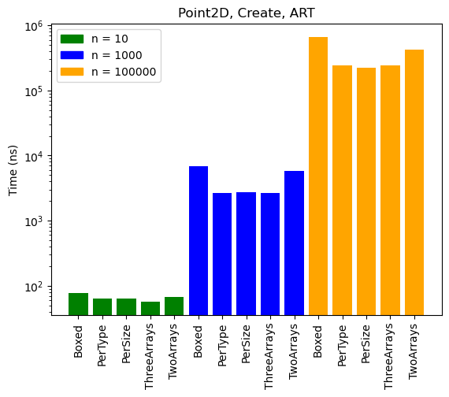


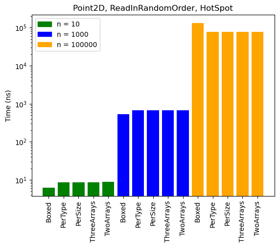


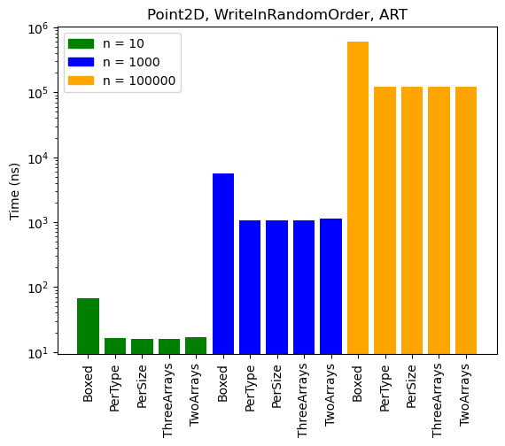


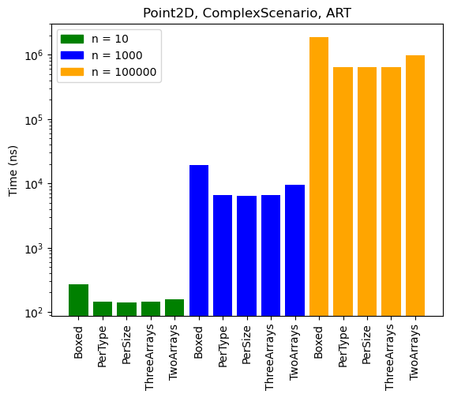


### `Rectangle`


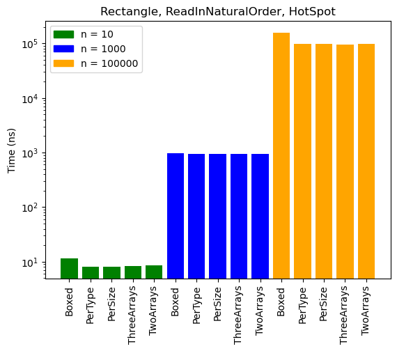


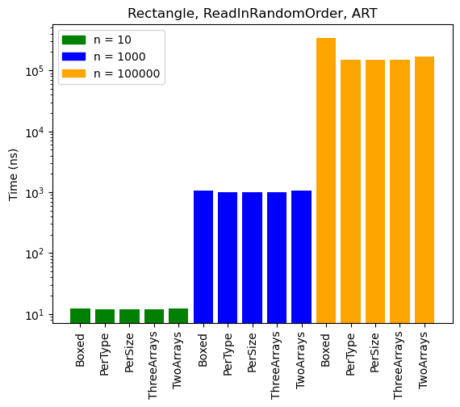

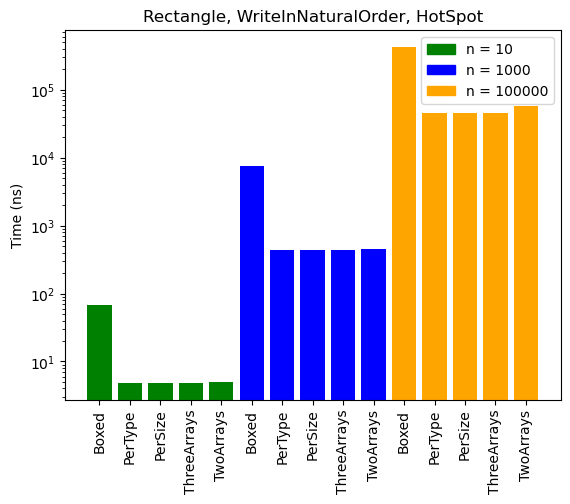


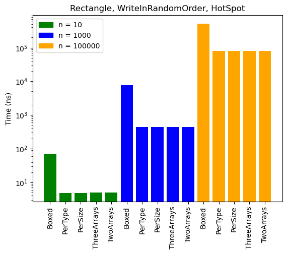


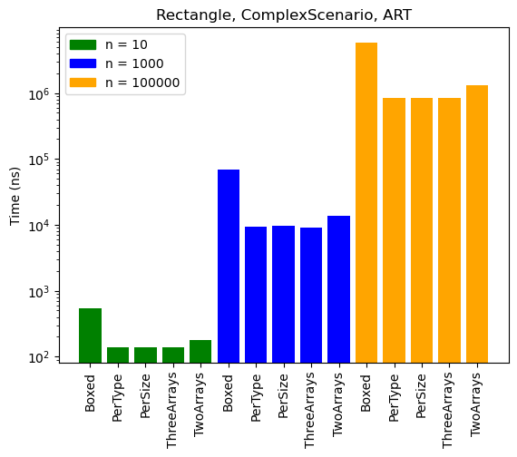

### `Triangle`

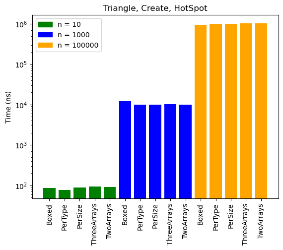


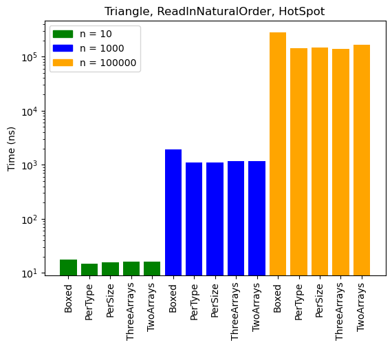


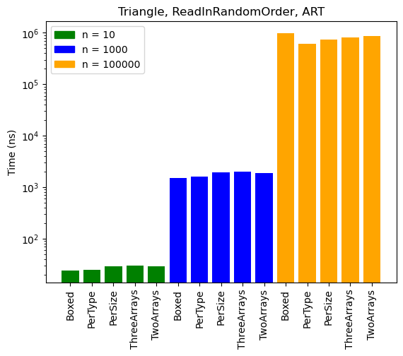


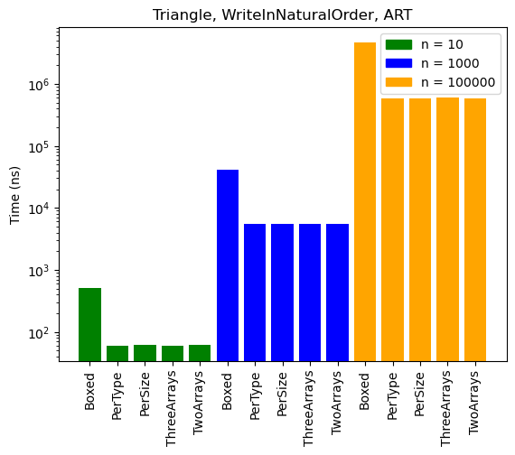

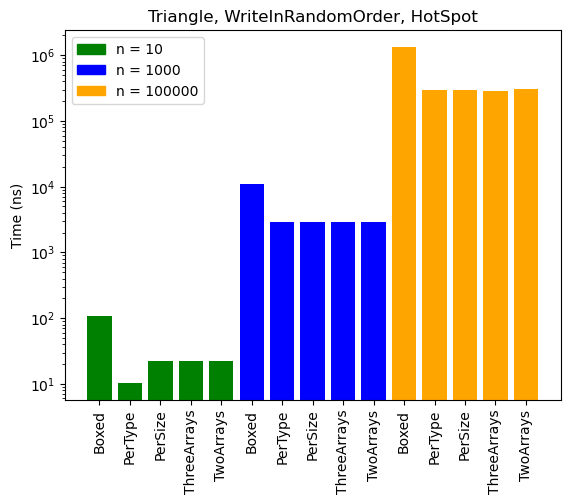


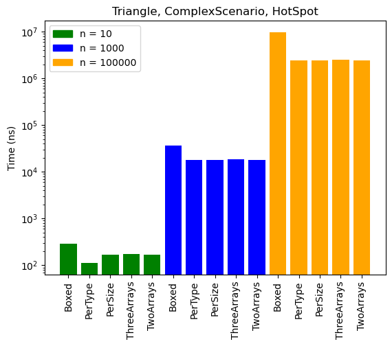


## Observations and conclusions